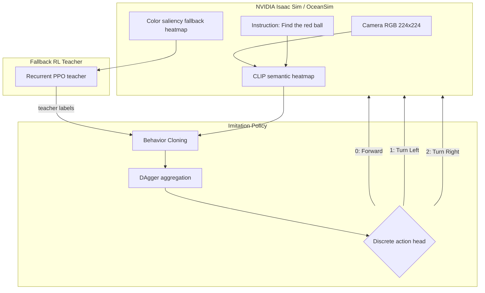

# Visual-Fusion-GRU: SLA-Aware Underwater VLA Navigation

> Status: The original RL-to-semantic migration plan found a repeatable
> choke point near pure semantic control. The current best GRU imitation
> student reaches `0.957` success rate over `1000` CLIP-view evaluation
> episodes after hard-case DAgger fine-tuning.

Visual-Fusion-GRU is a navigation framework for an autonomous robotic fish in
challenging underwater environments, such as turbidity, unstable lighting, and
frequent target loss. The long-term goal is still a VLA
(Vision-Language-Action) navigation policy: the robot should understand a
language instruction such as `Find the red ball`, ground that instruction in
camera observations, and output low-level swimming actions.

The project started with a clear guess:

> If a reliable color-saliency fallback policy can first learn the physical
> navigation behavior, then a hybrid observation
> `alpha * CLIP + (1 - alpha) * fallback` should let RL gradually migrate from
> low-level color cues to high-level semantic CLIP cues.

That guess was reasonable, and it shaped the previous plan. The fallback
signal is dense, stable, and physically useful. CLIP is semantically aligned
with the language instruction but much noisier as a control signal. So the
planned bridge was an alpha curriculum: start with fallback, slowly increase
CLIP weight, and end at `alpha=1.0`, where the policy uses pure semantic
heatmaps.

After testing, that plan is no longer the active path. The records show a
repeatable RL choke point near pure semantic control. The fallback policy can
track the target, and hybrid RL can move close to CLIP, but it does not survive
the last part of the migration. The project therefore moved to imitation
learning: use the working fallback policy as a teacher, collect teacher-labeled
examples, and train a CLIP-observation student with BC + DAgger. The latest
GRU student closes most of that gap, reaching `95.7%` success in a `1000`
episode pure-CLIP evaluation.

## Simulation Demos

Archived RL/fallback demos:

- [Fallback tracking demo (MP4)](https://github.com/sonjuonr/Visual_Fusion_GRU/blob/main/Desktop%202026.03.20%20-%2012.49.03.05_compressed.mp4)
- [Early environment setup (MP4)](https://github.com/sonjuonr/Visual_Fusion_GRU/blob/main/fixed_video_final.mp4)

These videos show that the fallback observation can drive basic turning and
tracking when the target is visible. They should now be read as evidence that
the teacher behavior exists, not as evidence that pure semantic VLA navigation
has already been solved.

## Current Outcome

The strongest released student is:

```text
models/student_gru_hard_cases_radius1_seed601000.pt
```

This file is a GitHub-friendly copy of:

```text
imitation_runs/dagger_gru_hard_cases_radius1_seed601000/checkpoints/student_hard_seed.pt
```

Evaluation summary:

| Policy | Evaluation | Success rate | Mean steps | Notes |
| :--- | :--- | ---: | ---: | :--- |
| BC-only MLP baseline | 20 episodes | 0.150 | 496.2 | Early transfer baseline; heavy left/right oscillation. |
| MLP DAgger `student_iter_04.pt` | 100 episodes | 0.660 | 46.1 | First sign that DAgger corrected off-policy states. |
| GRU DAgger `student_iter_08.pt` | 1000 episodes | 0.883 | 31.3 | Memory reduced target-loss shaking but still left 119 hard cases. |
| GRU hard-case student | 1000 episodes | 0.957 | 31.3 | Current best result after failed-seed/radius-1 hard-case fine-tuning. |

The current best result is supported by:

- Eval summary:
  `imitation_data/eval/dagger_gru_hard_cases_radius1_seed601000_1000eps/student_hard_seed_eval_1000eps.json`
- Hard-case report:
  `imitation_data/eval/dagger_gru_hard_cases_radius1_seed601000_1000eps/student_hard_seed_hard_cases.json`
- Training summary:
  `imitation_runs/dagger_gru_hard_cases_radius1_seed601000/summaries/hard_seed_dataset_train_summary.json`

## Original Plan

The original training roadmap was:

1. Train a fallback RL policy on a color saliency heatmap.
2. Use that policy as a stable base for target tracking.
3. Introduce CLIP/VLM heatmaps through alpha fusion:

   ```text
   obs = alpha * CLIP_heatmap + (1 - alpha) * fallback_heatmap
   ```

4. Slowly increase `alpha` until the policy reaches `alpha=1.0`.
5. Remove the fallback path and keep a pure semantic VLA policy.

This plan assumed that the policy behavior learned under fallback would remain
mostly reusable as the observation changed. In other words, the hope was that
the fallback heatmap and the CLIP heatmap were different views of the same
control problem.

## What Actually Happened

Phase B tested this directly. The curriculum was configured to move from
`alpha=0.992` to `alpha=1.0` with small `0.0005` milestones and a `0.9`
success-rate gate. The run advanced only to `alpha=0.9935` and then stalled:

| Alpha | Episodes | Successes | Success rate |
| :--- | ---: | ---: | ---: |
| 0.9920 | 80 | 73 | 0.912 |
| 0.9925 | 128 | 114 | 0.891 |
| 0.9930 | 2368 | 1602 | 0.677 |
| 0.9935 | 1244 | 643 | 0.517 |

Evidence:

- Config: `models/run_config_phaseb_hybrid.json`
- Monitor log: `monitor_logs/monitor_phaseb_resume_992_softgate_20260420_130251.monitor.csv`
- Resume ladder: `scripts/run_phaseb_resume_990to1000.sh`

The important result is not just that one run failed. The important result is
where it failed: extremely close to pure CLIP. Even tiny reductions in fallback
support caused a large drop in success. That means the final `0.5%` to `1%` of
fallback information was carrying a disproportionate amount of control-critical
signal.

At `alpha=0.993`, the fallback contribution is only `1 - alpha = 0.007`
(`0.7%` of the fused heatmap). The success collapse at this point suggests
that this tiny fallback slice still made high-value left/center/right decisions
in the underwater tracking task. In other words, the remaining fallback signal
was small in percentage but large in decision quality.

## My Guess About Why RL Gets Stuck

My current guess is that the RL curriculum is facing a representation mismatch,
not only a hyperparameter problem.

The fallback heatmap is a direct control feature. When the red ball is visible,
its peak usually gives a clean left/center/right steering cue. When CLIP takes
over, the heatmap is more semantic but less metrically reliable. It may still
mean "red ball is probably here", but the policy needs a very consistent
gradient-like steering signal. Near `alpha=1.0`, the remaining fallback signal
is too small to stabilize action selection.

That explains the observed behavior:

- Tracking works when the target is clearly inside the field of view.
- When the target leaves the field of view, the policy often shakes left/right
  instead of committing to a search pattern.
- Alpha values around `0.992` still work because fallback gives enough
  low-level geometry.
- Around `0.993` to `0.9935`, success collapses because CLIP dominates before
  the policy has learned a robust semantic search behavior.
- PPO then keeps sampling from its own unstable behavior, so the training data
  becomes full of bad recovery states and local loops.

So the previous guess was only half true. Fallback can teach the physical
navigation behavior, but direct RL annealing does not reliably transfer that
behavior into the CLIP observation space.

## Current Direction: Imitation Learning

The new plan keeps the useful part of the old plan: the fallback policy is
still valuable. But instead of asking RL to discover the migration through
reward, we use the fallback policy as a teacher.



Current IL assets:

- DAgger orchestration: `src/imitation/dagger.py`
- GRU student model code: `src/imitation/models.py`
- Balanced GRU DAgger config: `configs/imitation/dagger_gru_balanced.json`
- GRU student config: `configs/imitation/student_gru_balanced.json`
- DAgger run copy: `imitation_runs/dagger_gru_balanced/dagger_config.json`
- Teacher seed dataset summary:
  `imitation_data/teacher_seed_balanced/teacher_seed_balanced_dataset.summary.json`
- Current best model note: `models/CURRENT_BEST_STUDENT.md`
- Current best eval config: `configs/imitation/eval_current_best_student.json`

The balanced seed dataset contains `360` teacher episodes and `11720` labeled
records. The first CLIP-view BC student was weak: the recorded balanced
evaluation showed `0.15` success rate over `20` episodes, with a strong
left/right oscillation signature in the action histogram.

That weak BC result is why DAgger became central. BC only learns from teacher
states. DAgger collects states visited by the student, asks the teacher what
should have been done there, and then re-trains on those corrected
off-trajectory examples.

The successful imitation path was:

1. Start from the `360` episode balanced teacher seed dataset.
2. Run `8` balanced GRU DAgger iterations with `40` rollout episodes per
   iteration, alternating in-view tracking and out-of-view recovery cases.
3. Evaluate `student_iter_08.pt` on `1000` pure-CLIP episodes. It reached
   `0.883` success rate and exposed `119` hard-case seeds.
4. Collect failed-seed teacher labels and fine-tune the GRU student from those
   hard cases. This raised the hard-case student to `0.942` to `0.946` success
   in `1000` episode sweeps.
5. Expand the next hard-case set with seed radius `1`, producing `299`
   targeted hard-case episodes and `35573` new labeled records.
6. Fine-tune for `2` additional epochs at learning rate `5e-5`, producing the
   current best `0.957` success rate over `1000` episodes.

The final fine-tune used `73737` total labeled records from the balanced seed
dataset, the `8` balanced DAgger shards, and the radius-1 hard-case shard.

## Updated Training Timeline

| Phase | Strategy | Observation input | Status |
| :--- | :--- | :--- | :--- |
| Initial | Pure CLIP semantic RL | CLIP ViT-B/16 heatmap | Failed. Semantic heatmaps alone were not stable enough for RL exploration. |
| Phase A | Fallback-guided RL | Color saliency heatmap | Worked for visible-target tracking, but target-loss search remained unstable. |
| Phase B | Hybrid alpha-fusion RL | `alpha * CLIP + (1 - alpha) * fallback` | Tested and found a choke point near `alpha=0.9935`; did not reach `alpha=1.0`. |
| Phase C | BC imitation transfer | Fallback teacher labels, CLIP student obs | Baseline completed; BC alone was unstable (`0.15` over `20` episodes). |
| Phase D | Balanced GRU DAgger | CLIP heatmap sequence with GRU memory | Completed; `0.883` over `1000` episodes before hard-case mining. |
| Phase E | Hard-case GRU fine-tuning | Failed-seed/radius-1 teacher labels | Current best; `0.957` over `1000` pure-CLIP episodes. |

## Current Situation

The project now has a strong pure-CLIP imitation baseline:

- The fallback teacher remains useful and should be preserved.
- The RL alpha curriculum produced a meaningful negative result that shaped
  the final training plan.
- The GRU student uses pure CLIP observations at evaluation time.
- The current best model reaches `957 / 1000` successes on the latest sweep.
- The residual report contains `43` outright failures and `5` slow successes,
  so remaining work should focus on hard-case recovery rather than broad
  behavior learning.

## Current Plan

1. Preserve `models/student_gru_hard_cases_radius1_seed601000.pt` as the
   current public checkpoint.
2. Re-evaluate the current best model on wider seed ranges, not only the
   `601000` seed family.
3. Mine the remaining `48` hard cases from the latest report and collect
   another small teacher-labeled shard.
4. Keep hard-case fine-tuning conservative: short runs, low learning rate, and
   validation against the broad balanced benchmark to avoid overfitting.
5. Treat the RL alpha-fusion result as evidence, not a dead end: fallback
   remains a teacher and diagnostic signal, but the deployed student should use
   pure CLIP observations.

The story is therefore not "RL failed, start over." It is:

> RL proved that fallback tracking is learnable, and it also revealed that
> alpha annealing has a semantic-control choke point. Imitation learning then
> used the fallback policy as a teacher, added GRU memory for target-loss
> recovery, and used hard-case DAgger to bring the pure-CLIP student to about
> `95%` success.
