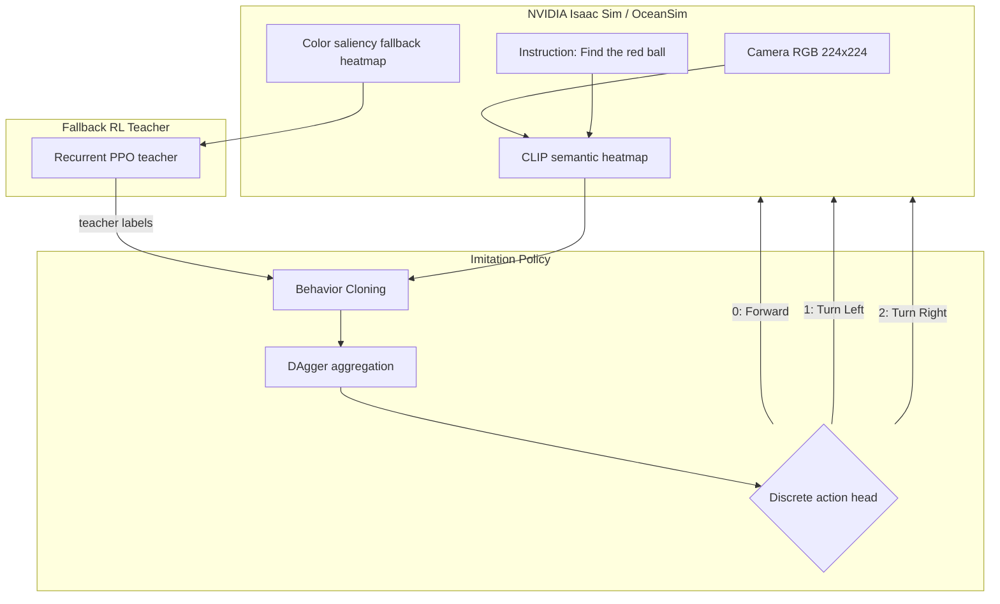

# Visual-Fusion-GRU: SLA-Aware Underwater VLA Navigation

> Status: RL alpha-fusion validation completed; active work has moved to imitation learning.

Visual-Fusion-GRU is a navigation framework for an autonomous robotic fish in
challenging underwater scenes. The original goal was a VLA
(Vision-Language-Action) policy that could migrate from a reliable color
saliency fallback observation to a pure CLIP/VLM semantic heatmap.

The current project finding is important: the RL curriculum exposes a clear
choke point during semantic migration. Fallback tracking works, but the
Recurrent PPO policy becomes unstable before reaching pure CLIP control. The
active direction is therefore imitation learning (BC + DAgger), using the
working fallback policy as a teacher and training a student on CLIP
observations.

## Simulation Demos

Archived RL/fallback demos:

- [Fallback tracking demo (MP4)](https://github.com/sonjuonr/Visual_Fusion_GRU/blob/main/Desktop%202026.03.20%20-%2012.49.03.05_compressed.mp4)
- [Early environment setup (MP4)](https://github.com/sonjuonr/Visual_Fusion_GRU/blob/main/fixed_video_final.mp4)

These videos show that the fallback observation can drive basic turning and
tracking when the target remains visible. They should now be read as the
motivation for the IL transfer stage, not as evidence that the pure semantic
policy is solved.

## Latest Finding

Phase B tried to anneal the observation:

```text
obs = alpha * CLIP_heatmap + (1 - alpha) * fallback_heatmap
```

The curriculum was configured to move from `alpha=0.992` to `alpha=1.0` with
small `0.0005` milestones and a `0.9` success-rate gate. In practice, the run
advanced only to `alpha=0.9935` and then stalled:

| Alpha | Episodes | Successes | Success rate |
| :--- | ---: | ---: | ---: |
| 0.9920 | 80 | 73 | 0.912 |
| 0.9925 | 128 | 114 | 0.891 |
| 0.9930 | 2368 | 1602 | 0.677 |
| 0.9935 | 1244 | 643 | 0.517 |

Evidence:

- Config: `my_projects/models/run_config_phaseb_hybrid.json`
- Monitor log: `my_projects/monitor_logs/monitor_phaseb_resume_992_softgate_20260420_130251.monitor.csv`
- Resume script target ladder: `my_projects/run_phaseb_resume_990to1000.sh`

This means the project no longer treats "just anneal alpha to 1.0 with RL" as
the main path. The RL result is preserved as a negative but useful result:
near-pure semantic observations create a policy-stability bottleneck before
full CLIP control.

## Current Direction: Imitation Learning

The current pipeline transfers control knowledge from a reliable fallback
teacher to a CLIP-observation student.



Current IL assets:

- DAgger orchestration: `my_projects/imitation/dagger.py`
- Balanced DAgger config: `my_projects/configs/imitation/dagger_balanced.json`
- DAgger run copy: `my_projects/imitation_runs/dagger_balanced/dagger_config.json`
- Teacher seed dataset summary:
  `my_projects/imitation_data/teacher_seed_balanced/teacher_seed_balanced_dataset.summary.json`
- Student evaluation summary:
  `my_projects/imitation_data/eval/eval_student_balanced_summary.json`

The balanced seed dataset contains `360` teacher episodes and `11720` labeled
records. The current CLIP-view BC student is still early: the recorded
balanced evaluation shows `0.15` success rate over `20` episodes, with a strong
left/right oscillation signature in the action histogram. That makes DAgger the
right next step, because it can collect labels on the states actually visited
by the student instead of only the fallback teacher's nominal trajectory.

## Training Evolution Timeline

| Phase | Strategy | Observation input | Result |
| :--- | :--- | :--- | :--- |
| Initial | Pure CLIP semantic RL | CLIP ViT-B/16 heatmap | Failed to converge reliably; semantic heatmap alone was too weak for stable RL exploration. |
| Phase A | Fallback-guided RL | Color saliency heatmap | Functional tracking when target is visible; target loss still causes oscillation and local loops. |
| Phase B | Hybrid alpha-fusion RL | `alpha * CLIP + (1 - alpha) * fallback` | Validated bottleneck. Curriculum stalls around `alpha=0.9935` and does not reach pure CLIP. |
| Phase C | Imitation transfer | Teacher fallback labels, student CLIP obs | Active. BC seed is implemented; DAgger is the current route for stability. |
| Phase D | Semantic VLA navigation | Pure CLIP/VLM heatmap | Goal remains, but through IL/DAgger rather than direct RL annealing. |

## Known Pain Points

- Target loss still induces action oscillation, especially left/right switching
  when the semantic heatmap is ambiguous.
- RL curriculum becomes brittle near pure semantic observations.
- Current BC student overfits the teacher distribution and needs DAgger
  rollouts to cover student-induced off-trajectory states.
- Evaluation at `fusion_alpha=1.0` is not yet stable enough to claim full VLA
  navigation.

## Practical Next Steps

1. Run the balanced DAgger loop and inspect per-iteration evaluation summaries.
2. Track action histograms, especially excessive turn-left/turn-right balance
   with very low forward action usage.
3. Add target-loss/search-specific scenarios to DAgger collection.
4. Compare student checkpoints on pure CLIP observations before reintroducing
   any hybrid-fusion curriculum.
