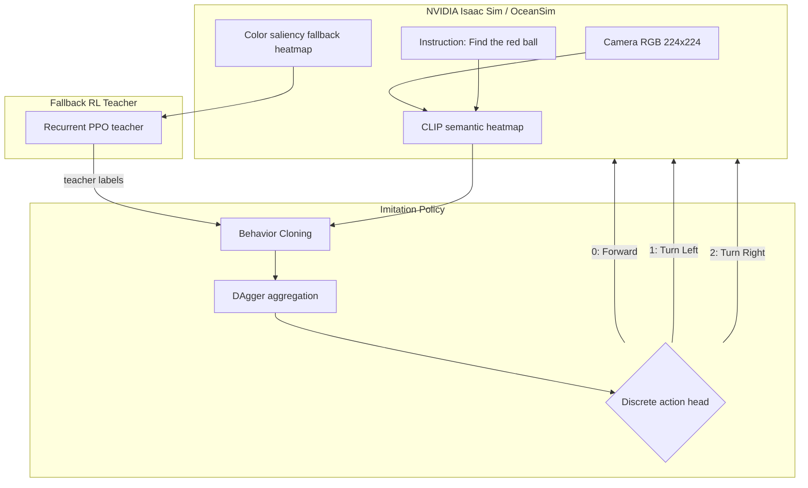

# Visual-Fusion-GRU: SLA-Aware Underwater VLA Navigation

> Status: The original RL-to-semantic migration plan has been tested and found to have a choke point. The project is now moving to imitation learning while preserving the same final VLA goal.

Visual-Fusion-GRU is a navigation framework for an autonomous robotic fish in
challenging underwater environments, such as turbidity, unstable lighting, and
frequent target loss. The long-term goal is still a VLA
(Vision-Language-Action) navigation policy: the robot should understand a
language instruction such as `Find the red ball`, ground that instruction in
camera observations, and output low-level swimming actions.

The project started with a clear guess:

> If a reliable color-saliency fallback policy can first learn the physical
> navigation behavior, then a hybrid observation
> `alpha * CLIP + (1 - alpha) * fallback` should let RL gradually migrate from
> low-level color cues to high-level semantic CLIP cues.

That guess was reasonable, and it shaped the previous plan. The fallback
signal is dense, stable, and physically useful. CLIP is semantically aligned
with the language instruction but much noisier as a control signal. So the
planned bridge was an alpha curriculum: start with fallback, slowly increase
CLIP weight, and end at `alpha=1.0`, where the policy uses pure semantic
heatmaps.

After testing, that plan is no longer the active path. The records show a
repeatable RL choke point near pure semantic control. The fallback policy can
track the target, and hybrid RL can move close to CLIP, but it does not survive
the last part of the migration. The current direction is imitation learning:
use the working fallback policy as a teacher, collect teacher-labeled examples,
and train a CLIP-observation student with BC + DAgger.

## Simulation Demos

Archived RL/fallback demos:

- [Fallback tracking demo (MP4)](https://github.com/sonjuonr/Visual_Fusion_GRU/blob/main/Desktop%202026.03.20%20-%2012.49.03.05_compressed.mp4)
- [Early environment setup (MP4)](https://github.com/sonjuonr/Visual_Fusion_GRU/blob/main/fixed_video_final.mp4)

These videos show that the fallback observation can drive basic turning and
tracking when the target is visible. They should now be read as evidence that
the teacher behavior exists, not as evidence that pure semantic VLA navigation
has already been solved.

## Original Plan

The original training roadmap was:

1. Train a fallback RL policy on a color saliency heatmap.
2. Use that policy as a stable base for target tracking.
3. Introduce CLIP/VLM heatmaps through alpha fusion:

   ```text
   obs = alpha * CLIP_heatmap + (1 - alpha) * fallback_heatmap
   ```

4. Slowly increase `alpha` until the policy reaches `alpha=1.0`.
5. Remove the fallback path and keep a pure semantic VLA policy.

This plan assumed that the policy behavior learned under fallback would remain
mostly reusable as the observation changed. In other words, the hope was that
the fallback heatmap and the CLIP heatmap were different views of the same
control problem.

## What Actually Happened

Phase B tested this directly. The curriculum was configured to move from
`alpha=0.992` to `alpha=1.0` with small `0.0005` milestones and a `0.9`
success-rate gate. The run advanced only to `alpha=0.9935` and then stalled:

| Alpha | Episodes | Successes | Success rate |
| :--- | ---: | ---: | ---: |
| 0.9920 | 80 | 73 | 0.912 |
| 0.9925 | 128 | 114 | 0.891 |
| 0.9930 | 2368 | 1602 | 0.677 |
| 0.9935 | 1244 | 643 | 0.517 |

Evidence:

- Config: `my_projects/models/run_config_phaseb_hybrid.json`
- Monitor log: `my_projects/monitor_logs/monitor_phaseb_resume_992_softgate_20260420_130251.monitor.csv`
- Resume ladder: `my_projects/run_phaseb_resume_990to1000.sh`

The important result is not just that one run failed. The important result is
where it failed: extremely close to pure CLIP. Even tiny reductions in fallback
support caused a large drop in success. That means the final `0.5%` to `1%` of
fallback information was carrying a disproportionate amount of control-critical
signal.

## My Guess About Why RL Gets Stuck

My current guess is that the RL curriculum is facing a representation mismatch,
not only a hyperparameter problem.

The fallback heatmap is a direct control feature. When the red ball is visible,
its peak usually gives a clean left/center/right steering cue. When CLIP takes
over, the heatmap is more semantic but less metrically reliable. It may still
mean "red ball is probably here", but the policy needs a very consistent
gradient-like steering signal. Near `alpha=1.0`, the remaining fallback signal
is too small to stabilize action selection.

That explains the observed behavior:

- Tracking works when the target is clearly inside the field of view.
- When the target leaves the field of view, the policy often shakes left/right
  instead of committing to a search pattern.
- Alpha values around `0.992` still work because fallback gives enough
  low-level geometry.
- Around `0.993` to `0.9935`, success collapses because CLIP dominates before
  the policy has learned a robust semantic search behavior.
- PPO then keeps sampling from its own unstable behavior, so the training data
  becomes full of bad recovery states and local loops.

So the previous guess was only half true. Fallback can teach the physical
navigation behavior, but direct RL annealing does not reliably transfer that
behavior into the CLIP observation space.

## Current Direction: Imitation Learning

The new plan keeps the useful part of the old plan: the fallback policy is
still valuable. But instead of asking RL to discover the migration through
reward, we use the fallback policy as a teacher.



Current IL assets:

- DAgger orchestration: `my_projects/imitation/dagger.py`
- Balanced DAgger config: `my_projects/configs/imitation/dagger_balanced.json`
- DAgger run copy: `my_projects/imitation_runs/dagger_balanced/dagger_config.json`
- Teacher seed dataset summary:
  `my_projects/imitation_data/teacher_seed_balanced/teacher_seed_balanced_dataset.summary.json`
- Student evaluation summary:
  `my_projects/imitation_data/eval/eval_student_balanced_summary.json`

The balanced seed dataset contains `360` teacher episodes and `11720` labeled
records. The current CLIP-view BC student is still early: the recorded
balanced evaluation shows `0.15` success rate over `20` episodes, with a strong
left/right oscillation signature in the action histogram.

This weak BC result is not the end of the IL path. It is exactly why DAgger is
needed. BC only learns from teacher states. DAgger collects states visited by
the student, asks the teacher what should have been done there, and then
re-trains on those corrected off-trajectory examples.

## Updated Training Timeline

| Phase | Strategy | Observation input | Status |
| :--- | :--- | :--- | :--- |
| Initial | Pure CLIP semantic RL | CLIP ViT-B/16 heatmap | Failed. Semantic heatmaps alone were not stable enough for RL exploration. |
| Phase A | Fallback-guided RL | Color saliency heatmap | Worked for visible-target tracking, but target-loss search remained unstable. |
| Phase B | Hybrid alpha-fusion RL | `alpha * CLIP + (1 - alpha) * fallback` | Tested and found a choke point near `alpha=0.9935`; did not reach `alpha=1.0`. |
| Phase C | Imitation transfer | Fallback teacher labels, CLIP student obs | Active. BC seed exists; DAgger is the current stability plan. |
| Phase D | Semantic VLA navigation | Pure CLIP/VLM heatmap | Still the final goal, but now approached through IL instead of direct RL annealing. |

## Current Situation

The project is now in a transition state:

- The fallback teacher is useful and should be preserved.
- The RL alpha curriculum produced a meaningful negative result.
- The pure CLIP student is not strong yet.
- The main failure mode is still search stability during target loss.
- The next milestone is not "reach alpha 1 with PPO"; it is "make the CLIP
  student recover from its own mistakes through DAgger".

## Current Plan

1. Run the balanced DAgger loop from `my_projects/configs/imitation/dagger_balanced.json`.
2. Inspect per-iteration summaries under `my_projects/imitation_runs/dagger_balanced`.
3. Watch the action histogram. The student should use more forward actions and
   less left/right shaking as DAgger improves.
4. Add target-loss/search-specific scenarios to DAgger collection.
5. Evaluate each student checkpoint on pure CLIP observations.
6. Only after the student becomes stable, reconsider whether hybrid fusion or
   GRU memory should be reintroduced for robustness.

The story is therefore not "RL failed, start over." It is:

> RL proved that fallback tracking is learnable, and it also revealed that
> alpha annealing has a semantic-control choke point. The next step is to use
> the fallback policy as a teacher and transfer its behavior into the CLIP
> observation space with imitation learning.

