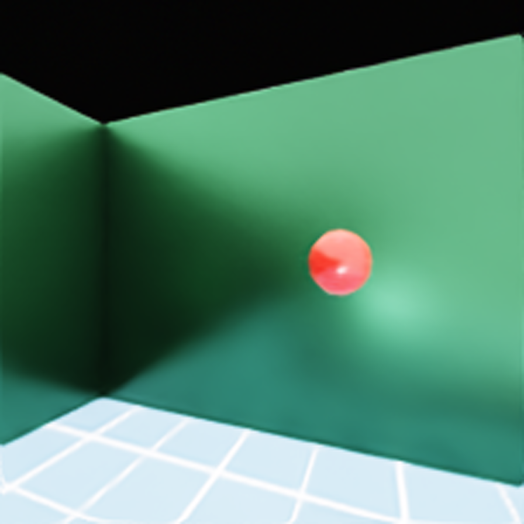

# GitHub Upload Notes

This folder is the GitHub-ready package for the Visual-Fusion-GRU project.
It is intentionally curated from the full Isaac Sim workspace.

Included:

- Project README and current research story.
- Simulation screenshot for GitHub preview:
  
- Source code under `src/`.
- Training, evaluation, and launch scripts under `scripts/`.
- Imitation configs under `configs/imitation/`.
- Compact trained artifacts under `models/`, including the current best GRU
  student:
  `models/student_gru_hard_cases_radius1_seed601000.pt`.
- Imitation datasets and DAgger run outputs under `imitation_data/` and
  `imitation_runs/`.
- Monitor logs and run summaries needed to support the RL choke-point finding.
- File manifests under `artifacts_manifest/`.

Current headline result:

- `0.957` success rate over `1000` pure-CLIP evaluation episodes.
- Eval summary:
  `imitation_data/eval/dagger_gru_hard_cases_radius1_seed601000_1000eps/student_hard_seed_eval_1000eps.json`
- Training summary:
  `imitation_runs/dagger_gru_hard_cases_radius1_seed601000/summaries/hard_seed_dataset_train_summary.json`
- Public model copy:
  `models/student_gru_hard_cases_radius1_seed601000.pt`

Not included:

- The full rolling `my_projects/checkpoints/` directory. It is about `891M`
  and mostly contains intermediate RL snapshots. The manifest is preserved in
  `artifacts_manifest/excluded_checkpoints.tsv`.
- TensorBoard event directories. They are useful locally but noisy for GitHub.
- MP4 demos. The README links to the existing GitHub-hosted demo files.

Recommended upload strategy:

1. Create a fresh GitHub repository from this folder.
2. Commit this curated package first.
3. Upload large checkpoint snapshots as GitHub Release assets or manage them
   with Git LFS if you really want them versioned.
4. Choose a license before making the repo public.

Useful commands:

```bash
cd Visual_Fusion_GRU_github
git init
git add .
git commit -m "Prepare Visual-Fusion-GRU project release"
```

Release helper scripts:

```bash
./scripts/run_dagger_release.sh
./scripts/run_dagger_gru_release.sh
./scripts/eval_student_release.sh
./scripts/eval_dagger_students_100eps.sh
./scripts/eval_dagger_students_200eps.sh
./scripts/eval_dagger_gru_students_200eps.sh
./scripts/eval_iter08_1000eps_and_extract_hard_cases.sh
./scripts/run_gru_hard_seed_dagger.sh
```

Runtime note:

The code expects NVIDIA Isaac Sim / Omniverse Python APIs to be available.
The `requirements.txt` file lists only the regular Python packages; it does
not install Isaac Sim itself.
